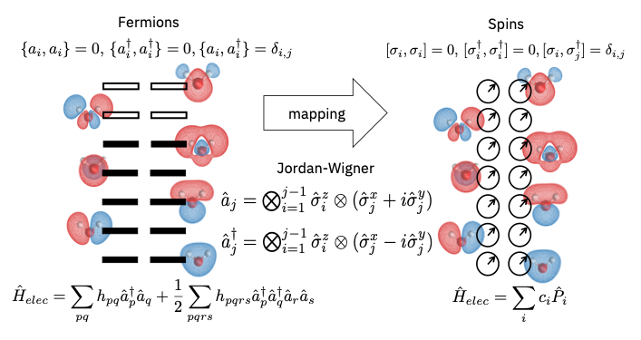
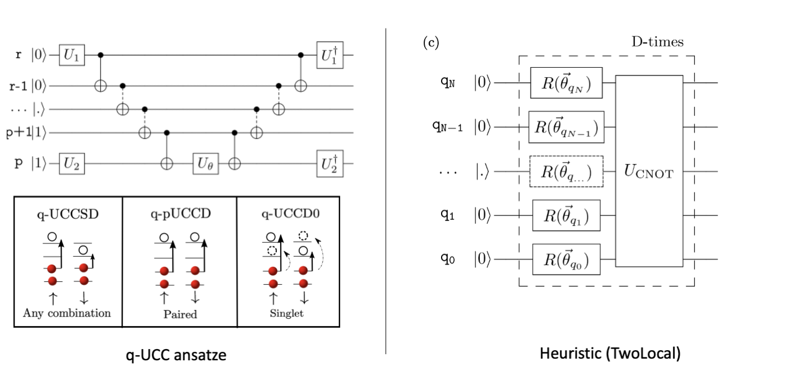
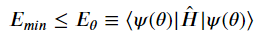

# Lithium Hydride molecule simulation

## VQE

During the last decade, quantum computers matured quickly and began to realize Feynman's initial dream of a computing system that could simulate the laws of nature in a quantum way. A 2014 paper first authored by Alberto Peruzzo introduced the Variational Quantum Eigensolver (VQE), an algorithm meant for finding the ground state energy (lowest energy) of a molecule, with much shallower circuits than other approaches.

VQE's magic comes from outsourcing some of the problem's processing workload to a classical computer. The algorithm starts with a parameterized quantum circuit called an ansatz (a best guess) then finds the optimal parameters for this circuit using a classical optimizer. The VQE's advantage over classical algorithms comes from the fact that a quantum processing unit can represent and store the problem's exact wavefunction, an exponentially hard problem for a classical computer.

Setting up a variational quantum eigensolver is vital to determine the ground state and the energy of a molecule. This is interesting because the ground state can be used to calculate various molecular properties, for instance the exact forces on nuclei than can serve to run molecular dynamics simulations to explore what happens in chemical systems with time.

## The Algorithm

The core idea hybrid quantum-classical approach is to outsource to CPU (classical processing unit) and QPU (quantum processing unit) the parts that they can do best. The CPU takes care of listing the terms that need to be measured to compute the energy and also optimizing the circuit parameters. The QPU implements a quantum circuit representing the quantum state of a system and measures the energy.

CPU can compute efficiently the energies associated to electron hopping and interactions (one-/two-body integrals by means of a Hartree-Fock calculation) that serve to represent the total energy operator, Hamiltonian. The Hartree–Fock (HF) method efficiently computes an approximate grounds state wavefunction by assuming that the latter can be represented by a single Slater determinant. What QPU does later in VQE is finding a quantum state (corresponding circuit and its parameters) that can also represent other states associated missing electronic correlations.

After a HF calculation, operators in the Hamiltonian are mapped to measurements on a QPU using fermion-to-qubit transformations. One can further analyze the properties of the system to reduce the number of qubits or shorten the ansatz circuit:

QPU implements quantum circuits, parameterized by angles  𝜃⃗ , that would represent the ground state wavefunction by placing various single qubit rotations and entanglers (e.g. two-qubit gates). The quantum advantage lies in the fact that QPU can efficiently represent and store the exact wavefunction, which becomes intractable on a classical computer for systems that have more than a few atoms. Finally, QPU measures the operators of choice (e.g. ones representing a Hamiltonian).

### Mapping

A representation of the Jordan-Wigner mapping between the 14 spin-orbitals of a water molecule and some 14 qubits is given below:

### Ansatz

There are mainly 2 types of ansatzes you can use for chemical problems. 

- **q-UCC ansatzes** are physically inspired, and roughly map the electron excitations to quantum circuits. The q-UCCSD ansatz (`UCCSD`in Qiskit) possess all possible single and double electron excitations. The paired double q-pUCCD (`PUCCD`) and singlet q-UCCD0 (`SUCCD`) just consider a subset of such excitations (meaning significantly shorter circuits) and have proved to provide good results for dissociation profiles. For instance, q-pUCCD doesn't have single excitations and the double excitations are paired as in the image below.
- **Heuristic ansatzes (`TwoLocal`)** were invented to shorten the circuit depth but still be able to represent the ground state. 
As in the figure below, the R gates represent the parametrized single qubit rotations and $U_{CNOT}$ the entanglers (two-qubit gates). The idea is that after repeating certain $D$-times the same block (with independent parameters) one can reach the ground state. 

Given a Hermitian operator H, the minimum energy can be calculated using below equation:

### Results

Exact electronic ground state energy for Lithium Hydride is : -1.08871
Calculated ground state energy for Lithium Hydride using VQE is : -1.08611
Percentage Error in calculating Ground state energy is : 0.24%

Graph of Energy VS Iterations is shown below:

